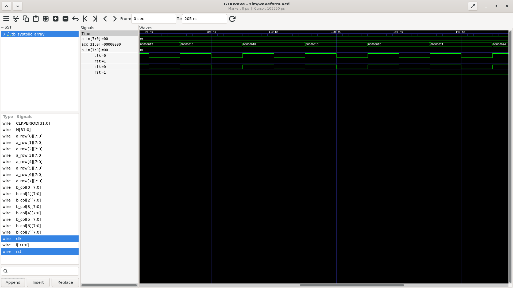

# 8×8 Systolic Array — Matrix Multiplication

A hardware implementation of an 8×8 systolic array for matrix multiplication, written in Verilog and simulated using Verilator + GTKWave.

## What is a Systolic Array?

A systolic array is a grid of Processing Elements (PEs) where data flows rhythmically through the array in sync with a clock — like a heartbeat. Each PE computes a multiply-accumulate (MAC) operation and passes data to its neighbors.

This architecture is used in:
- Google's TPU (Tensor Processing Unit)
- Neural network accelerators
- High-performance matrix operations

## Architecture
A[0] →  PE[0][0] → PE[0][1] → ... → PE[0][7]
A[1] →  PE[1][0] → PE[1][1] → ... → PE[1][7]
...
A[7] →  PE[7][0] → PE[7][1] → ... → PE[7][7]
↓           ↓                  ↓
B[0]        B[1]              B[7]
- Data flows **right** (A inputs) and **down** (B inputs)
- Each PE computes: `acc += a_in × b_in` every clock cycle
- 64 PEs total (8×8 grid)
- 8-bit inputs, 32-bit accumulated output

## Waveform Screenshot

> GTKWave simulation showing clock, reset, input vectors and accumulated outputs over 205ns



## Project Structure

```
systolic_array/
├── rtl/
│   └── systolic_array.v    # PE module + top-level array
├── tb/
│   └── tb_systolic_array.v # Testbench with waveform dump
├── scripts/
│   └── run_sim.sh          # Compile and simulate
├── docs/
│   └── waveform.png        # GTKWave screenshot
└── sim/
    └── waveform.vcd        # Simulation output (generated)
```

## Requirements

- Verilator 5.x
- GTKWave
- Linux / WSL2

## How to Run

```bash
# Clone the repo
git clone https://github.com/lakshhnaa/systolic-array.git
cd systolic-array

# Run simulation
bash scripts/run_sim.sh

# View waveforms
gtkwave sim/waveform.vcd
```

## Simulation Results

With inputs A = [1,2,3,4,5,6,7,8] and B = [1,2,3,4,5,6,7,8]:

| Output       | Value |
|--------------|-------|
| result[0][0] | 19    |
| result[0][1] | 36    |
| result[7][7] | 768   |

## Tools Used

| Tool        | Version |
|-------------|---------|
| Verilator   | 5.048   |
| GTKWave     | 3.x     |
| WSL2 Ubuntu | 24.x    |
